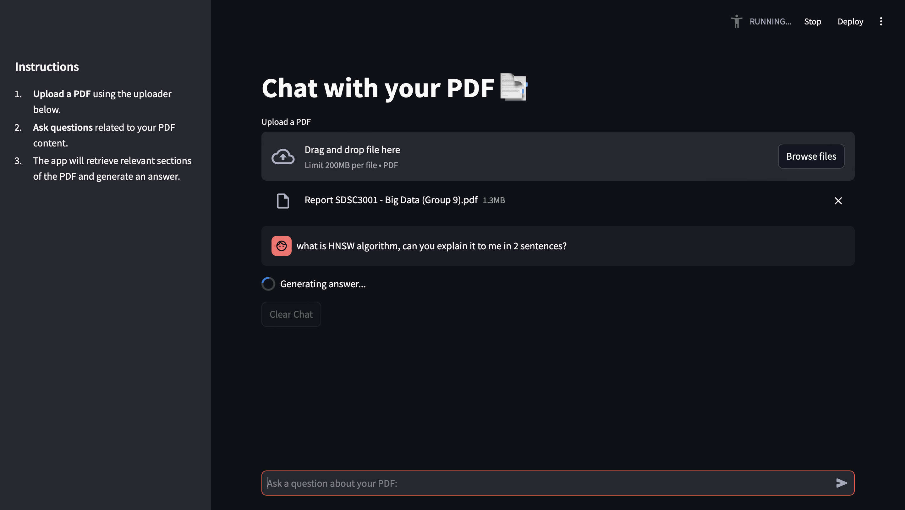

# Chat with Your PDF 📑

A Streamlit application that allows you to interactively chat with the contents of your PDFs. The app leverages a Retrieval-Augmented Generation (RAG) approach using a local [Ollama](https://ollama.com/library/deepseek-r1:8b) model (`deepseek-r1:8b`) for natural language processing along with Qdrant for vector storage and similarity search.



## Features

- **Upload & Process PDFs:** Easily upload PDFs, which are then processed and indexed.
- **Intelligent Q&A:** Ask questions related to your PDF, and the app retrieves relevant sections to generate concise and context-aware answers.
- **Local Inference:** Uses the local `deepseek-r1:8b` model via Ollama for generating responses.
- **Session Management:** Maintains conversation history and avoids reprocessing on every interaction.
- **User-Friendly UI:** Built with Streamlit and enhanced with progress indicators, a sidebar for instructions, and chat history display.

## Prerequisites

Before running the project, ensure you have the following installed:

- [Python 3.8+](https://www.python.org/downloads/)
- [Ollama](https://ollama.com/) with the `deepseek-r1:8b` model pulled locally
- [Streamlit](https://streamlit.io/)
- Required Python packages (listed in `requirements.txt`)

## Installation

1. **Clone the repository:**

   ```bash
   git clone https://github.com/imuki2004/PDF-QnA-App.git
   cd PDF-QnA-App

2. **Set up a virtual environment (optional but recommended):**

    ```bash
    python3 -m venv venv
    source venv/bin/activate  # On Windows use: venv\Scripts\activate

3. **Install dependencies:**

    ```bash
    pip install -r requirements.txt

4. **Pull deepseek-r1:8b model localy:**

    ```bash
    ollama pull deepseek-r1:8b

## Usage

1. **Start the Streamlit App:**

    ```bash
    streamlit run app.py

2. **Using the App:**

    - **Upload a PDF:** Use the file uploader to select and upload your PDF file.
    - **Chat Interface:** Once the PDF is processed, enter your questions in the chat input. The app will retrieve relevant sections of the PDF and generate a concise answer.
    - **Conversation History:** Your conversation history is displayed and maintained until you clear it or restart the app.

## Project Structure

    ├── app.py               # Streamlit UI for the application
    ├── rag.py               # Contains functions for PDF processing, indexing, retrieval, and answer generation
    ├── requirements.txt     # Python dependencies
    └── README.md            # This file
